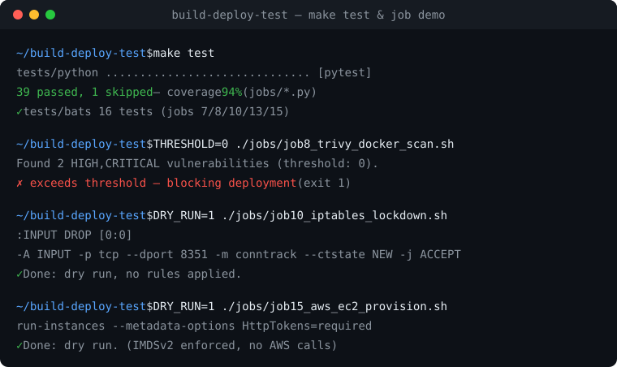

# Build & Deploy & Test

[](https://github.com/www8351/build-deploy-test/actions/workflows/ci.yml)
[](https://github.com/www8351/build-deploy-test/tree/python-coverage-comment-action-data)
[](LICENSE)

A DevOps lab: two interactive **Labs**, six **build/deploy Jobs** (Docker) wired together as a
Jenkins delivery pipeline, plus a **Security & Cloud backlog** (jobs 7–18) — SSH/firewall
hardening, CVE + file-integrity scanning, encrypted backups, async health monitoring, and
AWS/GCP provisioning & IAM audit. It also ships a **2026 open-source toolchain**: `uv`
(Python deps), **OpenTofu** (IaC), **Cilium** (eBPF NetworkPolicies) and **Falco** (runtime
threat detection), plus **CycloneDX/SPDX SBOMs** from the CVE scan. The repo was built
**one commit per step** so the git history reads as a step-by-step walkthrough.

> Scripts target a **Linux Jenkins agent** (they use `useradd`, a package manager and
> `docker`). Install scripts auto-detect `apt-get`, `dnf` or `yum`, so they run on
> Debian/Ubuntu **and** RHEL/CentOS.

## See it run



No cloud, no root, no risk — `make demo` runs the non-destructive dry-run jobs, and
`make test` runs the full suite:

```console
$ make test
tests/python ..............................  [pytest]
39 passed, 1 skipped — coverage 94% (jobs/*.py)
✓ tests/bats  16 tests  (jobs 7/8/10/13/15)

$ THRESHOLD=0 ./jobs/job8_trivy_docker_scan.sh      # CVE gate
Found 2 HIGH,CRITICAL vulnerabilities (threshold: 0).
✗ Vulnerability count exceeds threshold — blocking deployment.   (exit 1)

$ DRY_RUN=1 ./jobs/job10_iptables_lockdown.sh        # firewall, rendered not applied
--- DRY_RUN: iptables-restore input ---
:INPUT DROP [0:0]
-A INPUT -p tcp --dport 8351 -m conntrack --ctstate NEW -j ACCEPT
✓ Done: dry run, no rules applied.
```

## Repo layout

```
.
├── labs/
│   ├── lab1_menu.sh          # LAB 1 - bash menu
│   ├── lab2_menu.py          # LAB 2 - python menu
│   └── lab2_helper.sh        # LAB 2 - bash read-side helper
├── jobs/
│   ├── job1_users_tar.sh     # user + 5 files + tar
│   ├── job2_docker_nginx.sh  # pull/run nginx on :8351 + curl
│   ├── job3_containers_log.sh# dump container ID/Image/Name/IP -> Log.txt
│   ├── job4_pull_remote.sh   # pull an image on a remote host over SSH
│   ├── job5_deploy3_ips.sh   # run 3 containers + print their IPs
│   ├── job6_send_mail.sh     # "all good" mail at end of pipeline
│   ├── job7_ssh_hardening.sh      # idempotent sshd_config hardening + sshd -t + rollback
│   ├── job8_trivy_docker_scan.sh  # Trivy CVE scan gate (JSON + SBOM), blocks on threshold
│   ├── job9_fim_baseline.py       # file-integrity monitor: SHA-256 baseline in SQLite
│   ├── job10_iptables_lockdown.sh # default-DROP firewall via atomic iptables-restore
│   ├── job11_api_health_monitor.py# async API probes (aiohttp), Pydantic gate, p50/p95/p99
│   ├── job13_pg_dump_encrypt.sh   # pg_dump | zstd | gpg streamed encrypted backup
│   ├── job15_aws_ec2_provision.sh # AWS EC2 provision, IMDSv2-required, least-open SG
│   └── job18_gcp_iam_least_priv.py# GCP IAM audit: flag owner/editor, Markdown report
├── infra/                    # OpenTofu IaC: hardened EC2 (IMDSv2) + least-open SG
│   ├── main.tf variables.tf outputs.tf versions.tf   # + S3 remote-state backend
│   └── terraform.tfvars.example
├── k8s/cilium/               # Cilium eBPF NetworkPolicies (default-deny + allow-web)
├── falco/                    # Falco runtime threat-detection rules
├── tests/
│   ├── conftest.py           # importlib loader for the digit-prefixed job modules
│   ├── python/               # pytest: jobs 9/11/18 (unit + async + offline e2e)
│   └── bats/                 # bats-core: jobs 7/8/10/13/15 (dry-run / idempotency / gate)
├── pyproject.toml            # uv-managed deps + ruff + pytest/coverage config
├── Makefile                  # make test / lint / fmt — one-command entry point
├── Jenkinsfile               # pipeline-as-code: jobs 1-6 stages + opt-in security group
├── .github/workflows/ci.yml  # CI: lint + pytest matrix + coverage + bats + tofu validate
├── LICENSE                   # MIT
├── .gitattributes            # force LF on scripts (Linux agent)
└── .gitignore                # only README.md is tracked among *.md
```

## Quick start (run locally on a Linux box / agent)

```bash
git clone https://github.com/www8351/build-deploy-test.git
cd build-deploy-test
chmod +x labs/*.sh jobs/*.sh

# Labs (interactive menus)
./labs/lab1_menu.sh
python3 labs/lab2_menu.py
./labs/lab2_helper.sh

# Jobs (most take parameters via environment variables)
USER_NAME=tester1            ./jobs/job1_users_tar.sh
HOST_PORT=8351               ./jobs/job2_docker_nginx.sh
                             ./jobs/job3_containers_log.sh
REMOTE_HOST=10.0.0.5 IMAGE=nginx ./jobs/job4_pull_remote.sh
COUNT=3 IMAGE=nginx          ./jobs/job5_deploy3_ips.sh
RECIPIENT=you@example.com    ./jobs/job6_send_mail.sh

# Security & cloud jobs (7-18) — most are destructive or need creds; read the header first
sudo MAX_AUTH_TRIES=3        ./jobs/job7_ssh_hardening.sh          # edits sshd_config, validates, rolls back on fail
IMAGE=nginx THRESHOLD=0      ./jobs/job8_trivy_docker_scan.sh      # non-zero exit if HIGH/CRITICAL CVEs found
sudo ./jobs/job9_fim_baseline.py                                  # build baseline;  add --verify to diff
sudo ./jobs/job9_fim_baseline.py --verify
sudo DRY_RUN=true APP_PORT=8351 ./jobs/job10_iptables_lockdown.sh # render rules; DRY_RUN=false to apply
./jobs/job11_api_health_monitor.py --url https://example.com --count 20
GPG_RECIPIENT=you@example.com PGDATABASE=app ./jobs/job13_pg_dump_encrypt.sh
DRY_RUN=true ./jobs/job15_aws_ec2_provision.sh                    # needs aws-cli v2 + creds
./jobs/job18_gcp_iam_least_priv.py --project my-gcp-project       # needs ADC / workload identity
```

## The Labs

**LAB 1 — `labs/lab1_menu.sh`** (bash menu)
1. Create a new directory in `~/Desktop/`
2. Create a new user (by input)
3. Install `curl` & `tcpdump`

**LAB 2 — `labs/lab2_menu.py`** (python menu) + **`labs/lab2_helper.sh`** (bash)
- Python: create files in a folder · run Java installation · append a line to `Log.txt`
- Bash: list a folder · show `java -version` · print `Log.txt`

## The Jobs (Jenkins build steps)

| Job | Script | What it does | Parameters |
|-----|--------|--------------|------------|
| 1 | `job1_users_tar.sh` | create user, 5 files, `tar` them to `zipfile.tgz` | `USER_NAME` |
| 2 | `job2_docker_nginx.sh` | pull nginx, run on host `:8351`, `curl` it | `HOST_PORT` |
| 3 | `job3_containers_log.sh` | write each container's ID/Image/Name/IP to `Log.txt` | — |
| 4 | `job4_pull_remote.sh` | `ssh` to a remote host and `docker pull` an image | `REMOTE_HOST`, `REMOTE_USER`, `IMAGE` |
| 5 | `job5_deploy3_ips.sh` | deploy 3 containers, print their IPs | `COUNT`, `IMAGE` |
| 6 | `job6_send_mail.sh` | send an "all good" mail | `RECIPIENT`, `SUBJECT`, `BODY` |

## Security & Cloud jobs (7–18)

Hardening, scanning and cloud-provisioning steps added as an isolated backlog. Each is
standalone (not part of the 1→6 build flow) and self-contained: `set -Eeuo pipefail` /
custom exceptions, idempotent where it edits state, dry-run or rollback on the destructive
ones, structured (JSON / Markdown) output, and a **non-zero exit that gates a pipeline**.

| Job | Script | What it does | Key params / flags | Exit gate |
|-----|--------|--------------|--------------------|-----------|
| 7 | `job7_ssh_hardening.sh` | idempotent `sshd_config` hardening (`sed set_directive`), timestamped backup, `sshd -t` validate before reload, **trap auto-restores** on failure | `MAX_AUTH_TRIES`, `KEX`, `BACKUP` | fails if `sshd -t` rejects |
| 8 | `job8_trivy_docker_scan.sh` | Trivy CVE scan (local bin or `aquasec/trivy` container) → JSON report (+ optional SBOM), counts HIGH/CRITICAL | `IMAGE`, `SEVERITY`, `THRESHOLD`, `REPORT`, `SBOM_FILE`/`SBOM_FORMAT` | exit ≠0 if findings > `THRESHOLD` |
| 9 | `job9_fim_baseline.py` | file-integrity monitor: SHA-256 over `/etc`, `/var/spool/cron`, `/root/.ssh` → SQLite baseline; `--verify` diffs + JSON→syslog | `--verify`, `--paths`, `--db` | 0 clean / 1 drift / 2 error |
| 10 | `job10_iptables_lockdown.sh` | default-DROP INPUT/FWD/OUTPUT, allow lo + established + SSH/APP ports, rate-limited drop-LOG, atomic `iptables-restore` | `APP_PORT`, `SSH_PORT`, `DRY_RUN` | applies only when `DRY_RUN=false` |
| 11 | `job11_api_health_monitor.py` | concurrent async probes (aiohttp/asyncio), Pydantic v2 schema gate, p50/p95/p99 latency | `--url`/`--urls-file`, `--count`, `--concurrency`, `--timeout` | exit 1 if any endpoint unhealthy |
| 13 | `job13_pg_dump_encrypt.sh` | `pg_dump \| zstd \| gpg` **streamed** (no plaintext on disk), optional isolated temp keyring shredded on exit | `PGDATABASE`, `GPG_RECIPIENT`/`RECIPIENT_KEY_FILE`, `OUT_DIR`, `DRY_RUN` | fails on any pipe error |
| 15 | `job15_aws_ec2_provision.sh` | aws-cli v2 + JMESPath: least-open SG, **IMDSv2 required**, base64 user-data (docker + cloudwatch + ssh lockdown) | `AWS_REGION`, `AMI_ID`, `INSTANCE_TYPE`, `APP_PORT`, `DRY_RUN` | fails fast on missing creds |
| 18 | `job18_gcp_iam_least_priv.py` | GCP IAM audit: flag `roles/owner`\|`editor` bindings, append Markdown table | `--project` (or `--bindings-file` offline) | exit 1 on violations / 2 on error |

> ⚠️ Jobs 7 and 10 change system state (sshd, firewall). Job 10 defaults to **dry-run**;
> job 7 validates and **auto-rolls-back**. Cloud jobs 15/18 need real credentials
> (AWS creds / GCP ADC). Read each script's header block before running for real.

> Job numbers follow the original backlog; the gaps (12, 14, 16, 17) are backlog items
> not implemented here — the numbering is intentional, not missing work.

## 2026 toolchain & IaC

Modern open-source tooling layered on top of the jobs. Each was validated locally through its
official container (`ghcr.io/opentofu/opentofu`, `falcosecurity/falco`, `aquasec/trivy`).

### `uv` — Python environment & dependencies
`pyproject.toml` declares the Python jobs' deps (`aiohttp`, `pydantic`, optional `gcp` extra
for `google-cloud-resource-manager`) and the `ruff` lint config. **`uv` is the only Python
workflow — no `pip install` / `python -m venv`.** The resolved graph is pinned in a committed
`uv.lock` (68 packages), so every dev box and CI runner builds the *exact* same environment.

```bash
# Local: create .venv from the lockfile (fails if lock is stale — deterministic)
uv sync --all-extras --locked
uv run ruff check labs jobs tests
uv run pytest tests/python

# After changing deps in pyproject.toml: refresh + commit the lock
uv lock            # regenerate uv.lock
uv lock --check    # CI-style assert the lock matches pyproject
```

CI runs exactly `uv sync --all-extras --locked` in every Python job (`python`, `python-test`,
`security`) — a drifted or missing lock fails the build rather than silently resolving fresh.

### OpenTofu — Infrastructure as Code (`infra/`)
Declarative twin of `job15`: a hardened EC2 instance with **IMDSv2 required**
(`http_tokens = required`), a least-open security group and SSM-resolved Amazon Linux 2023.
The HCL is native OpenTofu (`required_version >= 1.6`, `hashicorp/aws` provider) — there is no
legacy Terraform Cloud / `remote` backend to migrate; `tofu validate` passes as-is.

**State + locking live on self-hosted infrastructure — no external SaaS** (no S3, no DynamoDB,
no Terraform Cloud), per the data-sovereignty mandate. The `pg` backend keeps state in an
internal PostgreSQL instance and locks via Postgres advisory locks. Credentials are injected at
init time, never committed:

```bash
cd infra
tofu fmt -check
# Self-hosted state backend on the isolated network (uncomment the pg backend in versions.tf):
tofu init -backend-config="conn_str=postgres://tfstate@tf-state.internal:5432/tfstate?sslmode=require"
tofu validate && tofu plan -var 'ssh_cidr=203.0.113.0/24'

# CI validates without a backend:
tofu -chdir=infra init -backend=false && tofu -chdir=infra validate
```

State files and the `.terraform/` provider cache are gitignored; `.terraform.lock.hcl` is
committed for reproducible provider versions.

### Cilium — eBPF network policy (`k8s/cilium/`)
The k8s/eBPF twin of `job10`'s firewall, zero-trust at **both** container and host level:
`00-default-deny.yaml` flips the `web` namespace to default-deny; `10-allow-web.yaml` re-opens
only TCP `8351` and DNS egress; `20-host-firewall.yaml` is a **clusterwide Host Firewall** that
default-denies the nodes themselves, permitting only cluster-essential traffic + mgmt SSH from
a restricted CIDR (not `0.0.0.0/0`).

Establish the eBPF datapath with Host Firewall + kube-proxy replacement, then apply:

```bash
# eBPF datapath (Host Firewall needs it explicitly enabled + the host devices named)
cilium install \
  --set hostFirewall.enabled=true \
  --set kubeProxyReplacement=true \
  --set devices='{eth0}'
cilium status --wait

kubectl apply -f k8s/cilium/
kubectl get ciliumclusterwidenetworkpolicy         # host firewall
kubectl -n web get ciliumnetworkpolicy             # namespace policies

# Stage the host policy safely (audit first — logs would-be drops, enforces nothing):
kubectl annotate cnp/host-firewall-zero-trust io.cilium.policy-audit-mode=true
cilium monitor --type policy-verdict               # confirm no essential traffic is dropped
kubectl annotate cnp/host-firewall-zero-trust io.cilium.policy-audit-mode-   # flip to enforce
```

### Falco — runtime threat detection (`falco/`)
`falco_rules.local.yaml` adds self-contained rules — sensitive-file reads
(`/etc/shadow`, authorized_keys), a shell spawned inside a container, and writes under `/etc`
— complementing the `job9` file-integrity baseline at runtime. `falco.yaml` is the runtime
config, built around two constraints:

- **Kernel safety** — the `modern_ebpf` (CO-RE) driver: no out-of-tree kernel module is
  compiled or loaded, so Falco cannot destabilize the kernel.
- **Data sovereignty** — events go **only** to localized sinks (a root-owned JSON log at
  `/var/log/falco/events.log` + local syslog). Every external output — `http_output`, `grpc`,
  `program_output`, the k8s-audit `webserver` — is explicitly **disabled**, so no threat data
  leaves the host through Falco.

```bash
falco --validate falco/falco_rules.local.yaml     # rules are syntax-checked in CI-style
install -o root -g root -m 0600 /dev/null /var/log/falco/events.log   # strict audit sink
falco -c falco/falco.yaml                          # run with the hardened config
```

### SBOM (Job 8)
`job8` emits a Software Bill of Materials next to the CVE report — **CycloneDX** by default,
**SPDX** on request — generated *before* the vulnerability gate so it exists as evidence even
for an image that fails the scan:

```bash
SBOM_FORMAT=cyclonedx  ./jobs/job8_trivy_docker_scan.sh   # -> sbom.cdx.json
SBOM_FORMAT=spdx-json  ./jobs/job8_trivy_docker_scan.sh
```

## Testing

The suite is a real CI gate, not decoration — pushes and PRs must pass it. One command runs
everything:

```bash
make test          # pytest (Python jobs) + bats (shell jobs)
make test-py       # Python only, with the coverage gate
make test-bats     # shell only
make lint          # ruff + shellcheck + bash -n
```

**Python (`tests/python/`, pytest).** The digit-prefixed job modules are loaded by file path
via an `importlib` helper in `tests/conftest.py`. Coverage is scoped to `jobs/*.py` and gated
at **≥80%** (currently ~94%):

- **job9 (FIM)** — `sha256_file` vs a hashlib reference (incl. the >64 KiB chunk loop),
  `build_baseline` row-count + DELETE/insert idempotency, and the money path: `verify` returns
  0 clean / 1 on a real add·remove·modify (mutated mid-test, so the drift check can't pass
  vacuously) / raises on a missing or empty baseline.
- **job11 (health monitor)** — pure `percentile`/`summarize` edge cases, plus `probe_once`
  driven against a **loopback aiohttp test server** (200-JSON / non-JSON / array / 500 /
  timeout) — no real network, so it never flakes.
- **job18 (GCP IAM)** — `analyze`/`to_markdown` plus an offline end-to-end run through
  `--bindings-file` asserting exit 1 on violations, 0 when clean.

**Shell (`tests/bats/`, bats-core).** Ops scripts are exercised through their **dry-run /
idempotency / arg-guard** surfaces only — a `setup()` stub dir shadows `sudo`, `sshd`,
`iptables-restore` and `aws`, and the "must never run" stubs fail loudly, so a test that
reaches a real system call is caught. job7 proves `set_directive` idempotency (no duplicate
lines on re-run); job8 stubs `trivy` with canned JSON fixtures to prove the CVE gate blocks
an over-threshold image and passes a clean one; job10/13/15 assert their rendered rulesets /
pipelines / plans. Shell coverage is measured as enumerated behaviour, not a line-percentage
(no flaky `kcov` step).

## Security

A security repo should scan itself. CI has a dedicated **`security`** job:

- **gitleaks** — secret detection on every push/PR, plus a weekly full-history sweep.
- **ruff `flake8-bandit` (`S`)** — Python SAST gate (pinned ruff for determinism).
- **Dependabot** — `pip` + `github-actions` CVE/version PRs.

Policy, scope, threat model and disclosure: **[SECURITY.md](SECURITY.md)**. It is deliberately
honest about what the lab does *not* protect against (permissive network defaults, no IaC
misconfig scan yet, single-trusted-operator model).

## Jenkins setup

### 1. Install Jenkins
Install Jenkins + a JDK on the controller, start the service, unlock with the initial admin
password, then install suggested plugins.

### 2. Let the `jenkins` user run the job commands
Several jobs need `sudo` (useradd, package installs, docker). Grant it with `visudo`:

```bash
sudo visudo
# add a line:
jenkins ALL=(ALL) NOPASSWD: ALL          # lab/demo scope; tighten for production
# and let jenkins use docker:
sudo usermod -aG docker jenkins
sudo systemctl restart jenkins
```

### 3. Required plugins
- **Pipeline + Git / GitHub** — run the `Jenkinsfile` from SCM (part of suggested plugins)
- **Timestamper** — the pipeline's `timestamps()` option (part of suggested plugins)
- Only for the freestyle alternative (4b): **Parameterized Trigger** to chain jobs,
  **Delivery Pipeline** to visualize Job 1 → … → Job 6

### 4. Build the pipeline — pipeline-as-code (recommended)

The repo ships a declarative **`Jenkinsfile`** that runs Jobs 1→6 as stages of a single
pipeline. Set it up once:

1. **New Item → Pipeline** (name it e.g. `build-deploy-test`).
2. **Pipeline → Definition**: *Pipeline script from SCM* → **Git** →
   `https://github.com/www8351/build-deploy-test.git`, branch `main`,
   script path `Jenkinsfile`.
3. **Build with Parameters** — every job parameter is exposed with a sane default:

   | Parameter | Default | Used by |
   |-----------|---------|---------|
   | `USER_NAME` | `tester1` | Job 1 |
   | `HOST_PORT` | `8351` | Job 2 |
   | `REMOTE_HOST` | *(empty — stage skipped)* | Job 4 |
   | `REMOTE_USER` | `root` | Job 4 |
   | `IMAGE` | `nginx` | Jobs 4/5 |
   | `COUNT` | `3` | Job 5 |
   | `RECIPIENT` | *(empty — stage skipped)* | Job 6 |
   | `SUBJECT`, `BODY` | "all good" defaults | Job 6 |

   Job 4 (remote pull) and Job 6 (mail) **skip automatically** when `REMOTE_HOST` /
   `RECIPIENT` are left empty, so the pipeline runs green out-of-the-box on a single agent.
   A *Preflight* stage wipes stale artifacts and fails fast if the agent lacks docker or
   passwordless sudo. `Log.txt` and `zipfile.tgz` are archived on every run.

   Security jobs 7–18 are wired in as an **opt-in `Security & Compliance` stage group,
   all default-skipped**. Enable a job with its boolean parameter; the destructive ones
   (job 7 sshd, job 10 iptables) are guarded default-false, and job 10 defaults to
   `IPTABLES_DRY_RUN=true`. Preflight also wipes their scan/report artifacts.

### 4b. Alternative: chained freestyle jobs (the classic way)

Create one freestyle job per script. In each:
- **Source Code Management → Git**: `https://github.com/www8351/build-deploy-test.git`
- **Build → Execute shell**: `bash jobs/jobN_*.sh`
- **Post-build → Trigger parameterized build on other projects**: the next job, passing
  parameters (e.g. `REMOTE_HOST`, `RECIPIENT`).

Chain: **Job1 → Job2 → Job3 → Job4 → Job5 → Job6**. Add all six to a **Delivery Pipeline**
view to watch the flow. Job 6 is the final "all good" notification — in production use the
**Editable Email Notification** (email-ext) post-build step with your SMTP server instead of
the CLI `mail` fallback.

## Notes
- `.gitignore` keeps the repo clean: every `*.md` is ignored except this `README.md`. Local
  lifecycle files (`STATUS.md`, `PROGRESS.md`, `DECISIONS.md`, `CLAUDE_MEMORY.md`) live on
  disk but are never pushed. It also ignores `.venv/`, `uv.lock`, `infra/.terraform/`,
  `*.tfstate*`, `terraform.tfvars`, and job runtime artifacts (`trivy_report.json`,
  `sbom.cdx.json`, `fim_baseline.db`, `iam_audit.md`).
- `.gitattributes` forces LF endings on `*.sh`/`*.py` so the Linux agent never chokes on CRLF.
- **CI** (`.github/workflows/ci.yml`): a *Shell lint* job (`bash -n` + ShellCheck over
  `labs/`+`jobs/`) and a *Python lint* job (`uv sync` → `ruff` → `compileall`). Docs-only per-
  directory notes live in each file's header comment, since every non-README `*.md` is ignored.
